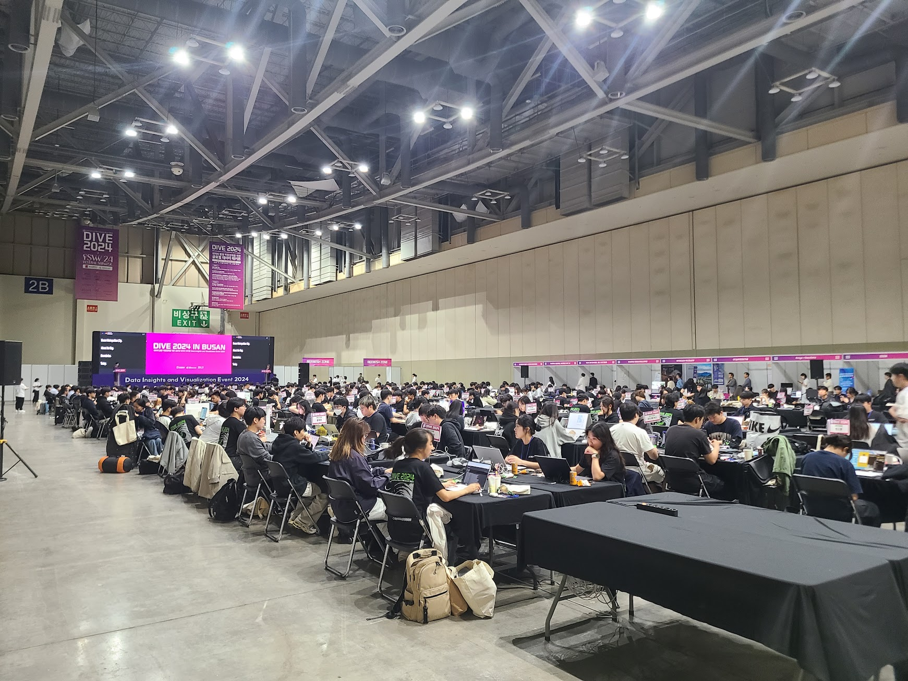
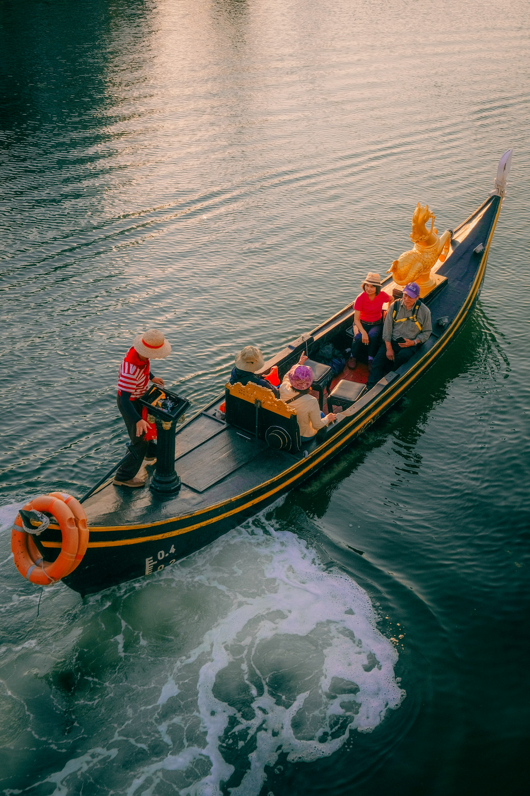

## 문제 1

Q: 다음 이미지에 대한 설명 중 옳지 않은 것은 무엇인가요?

- (1) 많은 사람들이 큰 홀에 모여 앉아 있습니다.
- (2) 벽에는 밝은 색의 포스터가 걸려 있습니다.
- (3) 사람들이 노트북을 사용하고 있는 모습입니다.
- (4) 천장에 조명이 꺼져 있습니다.

Listening: Which of the following descriptions of the image is incorrect?

- (1) Many people are gathered in a large hall.
- (2) There are bright-colored posters on the wall.
- (3) People are using laptops.
- (4) The lights on the ceiling are turned off.

정답: (4) 천장에 조명이 꺼져 있습니다.

----------------------------------

## 문제 2

Q: 다음 이미지에 대한 설명 중 옳지 않은 것은 무엇인가요?
- (1) 카페 내부의 모습입니다.
- (2) 벽 중 하나는 노란색입니다.
- (3) 두 사람이 서빙을 하고 있습니다.
- (4) 창문을 통해 바깥이 보입니다.

Listening: Which of the following descriptions of the image is incorrect?
- (1) It shows the inside of a café.
- (2) One of the walls is yellow.
- (3) Two people are serving.
- (4) The outside is visible through the windows.

정답: (3) 두 사람이 서빙을 하고 있습니다.

----------------------------------

## 문제 3

Q: 다음 이미지에 대한 설명 중 옳지 않은 것은 무엇인가요?
- (1) 사람들이 카페에서 이야기를 나누고 있습니다.
- (2) 창밖으로 푸른 하늘이 보입니다.
- (3) 바닥은 나무로 마감되어 있습니다.
- (4) 천장에 여러 개의 조명이 설치되어 있습니다.

Listening: Which of the following descriptions of the image is incorrect?
- (1) People are chatting in a cafe.
- (2) The blue sky is visible through the windows.
- (3) The floor is finished with wood.
- (4) Several lights are installed on the ceiling.

정답: (2) 창밖으로 푸른 하늘이 보입니다.

----------------------------------

## 문제 4

Q: 다음 이미지에 대한 설명 중 옳지 않은 것은 무엇인가요?
- (1) 보트 위에 여러 사람이 타고 있습니다.
- (2) 노란색 조각상이 배 앞쪽에 있습니다.
- (3) 물 위에 배가 정박해 있는 모습입니다.
- (4) 조종사는 빨간색과 흰색 줄무늬 셔츠를 입었습니다.

Listening: Which of the following descriptions of the image is incorrect?
- (1) There are several people on the boat.
- (2) A yellow statue is at the front of the boat.
- (3) The boat is docked on the water.
- (4) The operator is wearing a red and white striped shirt.

정답: (3) 물 위에 배가 정박해 있는 모습입니다.

----------------------------------

